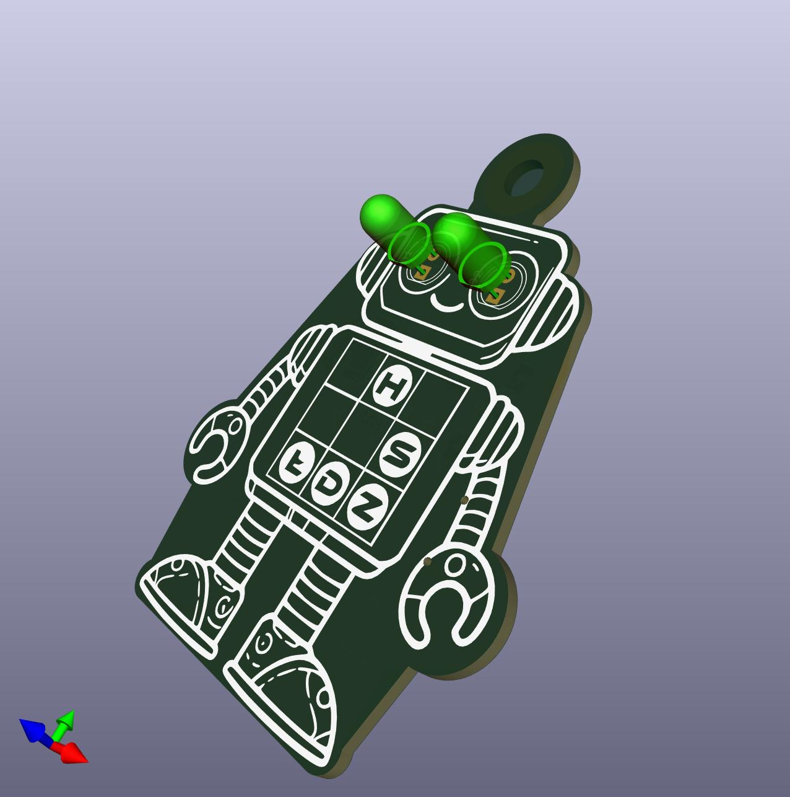
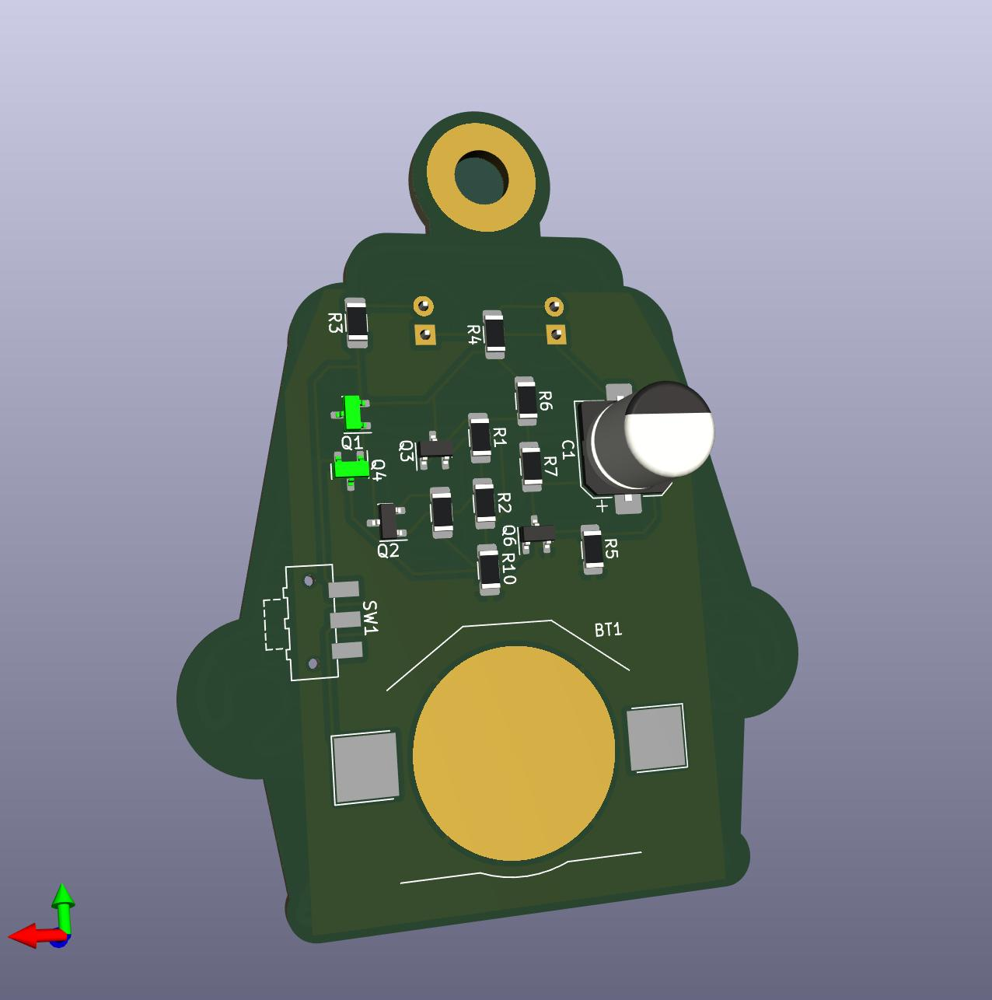
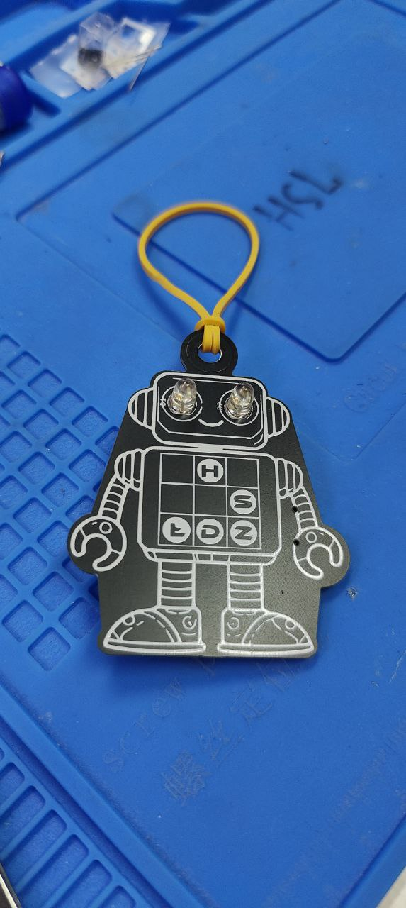
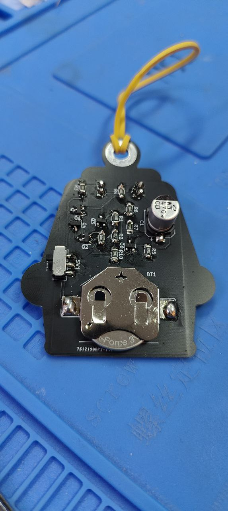

# HS-LDZ_badge
Hakierspejs Łódź badge, on which we teach people how to solder.

### Assumptions:

- Simple circuit
- Small number of components
- Relatively short assembly time
- Practical use

  The circuit is an implementation of the LM3909 using discrete components, based on the design from the link below :
  (https://www.righto.com/2021/01/reverse-engineering-low-power-led.html)

  LTspice model is based on work from link :
  (https://softsolder.com/2020/09/03/discrete-transistor-lm3909-led-flasher/)

